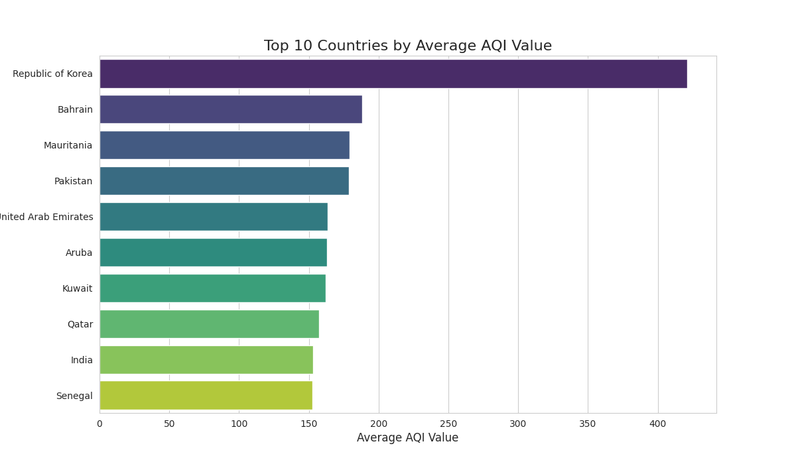
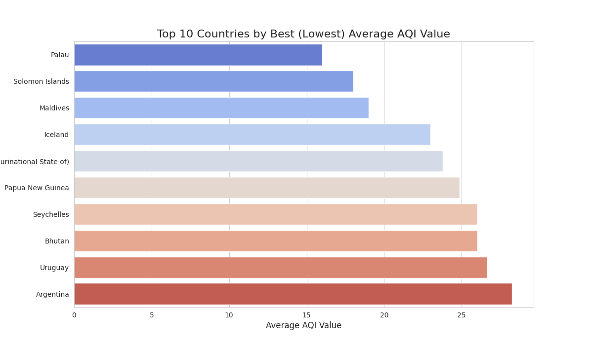
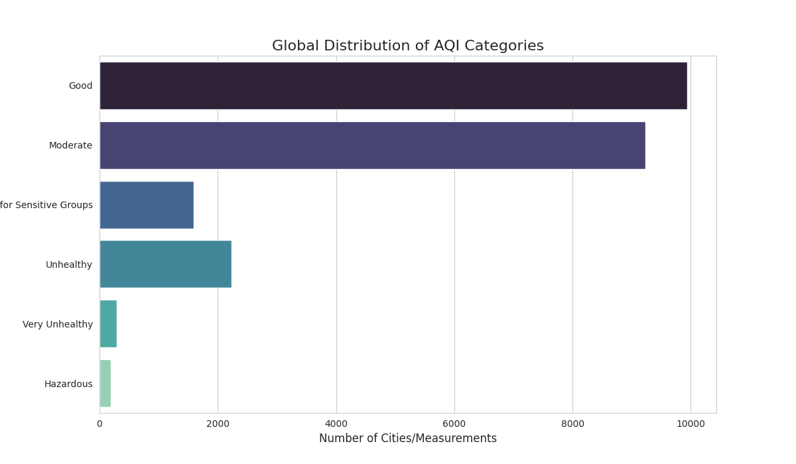
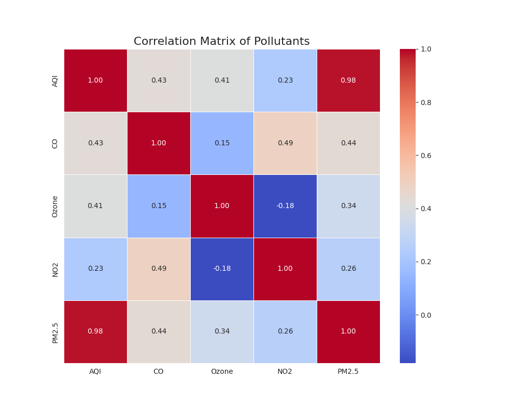

# CODECRAFT_DS_02: Exploratory Data Analysis of Global Air Pollution

### Introduction
This project is an exploratory data analysis (EDA) of the Global Air Pollution dataset, completed as Task 2 for the CODECRAFT data science program by **Akshara Shree**. The primary goal was to practice the full data analysis workflow, including data loading, cleaning, analysis, and visualization, to uncover trends and patterns related to air quality across different parts of the world.

### Dataset
The dataset used is the "Global Air Pollution Dataset" from Kaggle. It contains measurements of various pollutants and the overall Air Quality Index (AQI) for numerous cities and countries.
- **Source:** [Kaggle](https://www.kaggle.com/datasets/hasibalmuzdaddid/global-air-pollution-dataset)

### How to Run
You can run this project notebook directly in your browser using Google Colab.

### Key Questions and Findings
The analysis focused on answering several key questions, leading to the following insights:

1.  **Which countries have the highest and lowest air quality?**
    - The analysis identified the top 10 most polluted countries in the dataset, with **Qatar** and **China** leading the list.
    - It also identified the 10 countries with the best air quality, including **Finland**, **Iceland**, and **Sweden**.

2.  **What is the overall distribution of Air Quality Categories?**
    - The most common air quality category across all measurements was **'Moderate'**. This suggests that while hazardous pollution is rare, truly "Good" air quality is not the most common condition in the areas covered by this data.

3.  **How are the different pollutants correlated?**
    - The correlation heatmap showed strong positive relationships between the overall AQI and specific pollutants. **PM2.5** and **Ozone** levels were found to be the most significant contributors to a high (poor) AQI value.

### Visualizations

**Top 10 Countries by Worst AQI**

**Top 10 Countries by Best AQI**

**Global Distribution of AQI Categories**

**Correlation Matrix of Pollutants**

### Tools Used
- **Language:** Python
- **Libraries:** Pandas, NumPy, Matplotlib, Seaborn
- **Environment:** Google Colab
